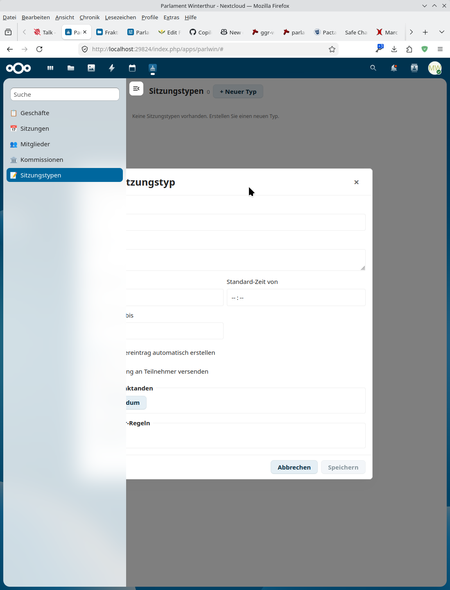
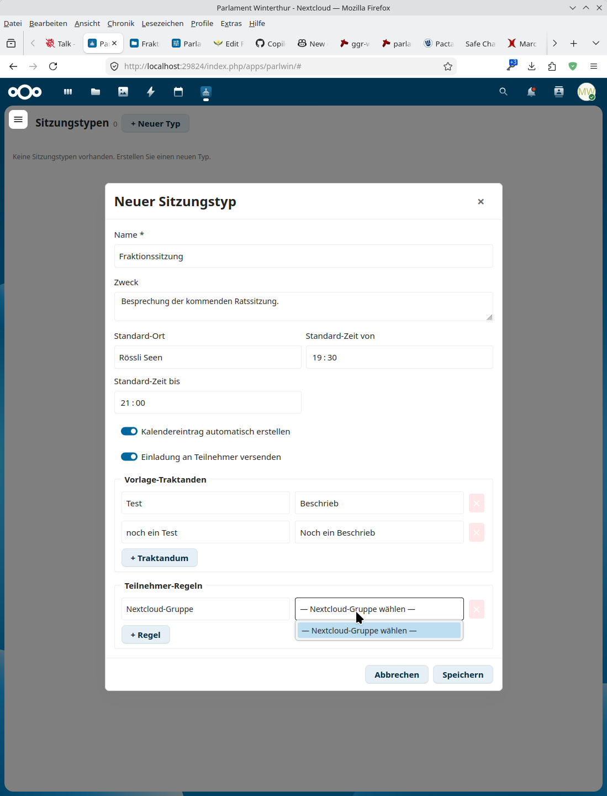
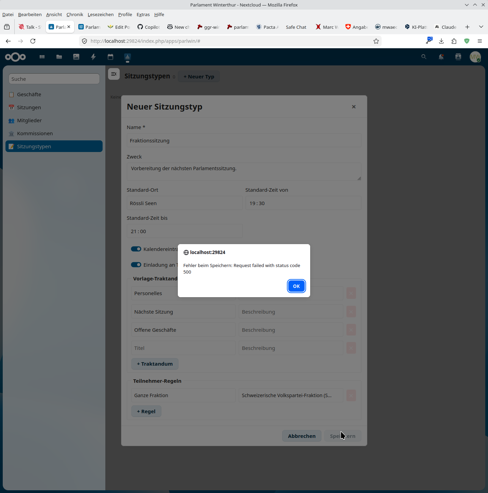
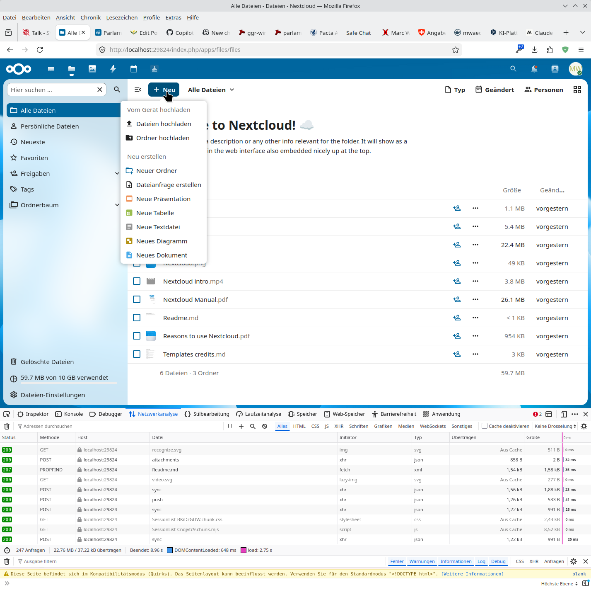

# Parlament Winterthur Tool

Nextcloud-Plugin für die Fraktionsarbeit im Winterthurer Parlament.

## Zu Erledigen:

  - Neuer Sitzungstyp: 
  - Nextcloud-Gruppe kann nicht gewählzt werden: , Benutzer ebensowenig! Fraktionsrolle hat keine Auswahl. Kommission wählen ist immer noch alte Schreisse drin!
  - FEHLER BEIM SPEICHERN KOMMT IMMER NOCH


  - (offen) Falls beim Öffnen eines bereits existierenden Dokuments aus der
    Geschäfts-Ansicht weiterhin lange Wartezeiten auftreten: das ist die
    Collabora-/Office-Startzeit (Server-Cold-Start). Workaround in v1.1.0:
    Beim *Erstellen* wird die Datei direkt in einem neuen Tab geöffnet, so
    dass die Ladezeit parallel zur Modal-Schliessung läuft.

## Erledigt:

  - ✅ Z-Index-Fix Modal-Overlay (v1.1.0): `.pw-modal-overlay` z-index von
    10000 auf 100000 angehoben, damit Sitzungstyp-/Sitzung-/Dokument-Modale
    sicher über der Nextcloud-App-Navigation liegen (insbesondere im
    eingeklappten/Mobile-Layout, wo die Sidebar einen eigenen Stacking-Context
    aufmachte).
  - ✅ „+ Neue Sitzung"-Knopf sichtbar (v1.1.0): NcActions mit
    `:force-name="true"` (zeigt den Text dauerhaft) und `margin-inline-start:
    auto` rechtsbündig. Wenn keine Sitzungstypen vorhanden sind, wird
    stattdessen ein deaktivierter `NcButton` mit Tooltip „Zuerst unter
    Sitzungstypen einen Typ anlegen" gerendert – statt eines unsichtbaren
    Icons mit Tooltip.
  - ✅ Protokoll-Abnahme & Nicht-Geschäfts-Traktanden (v1.1.0): Traktanden
    ohne verknüpftes Geschäft (z.B. „Abnahme Parlaments-Protokolle") zeigen
    jetzt das ↗-Symbol mit Link auf `sitzung.url` (Originaltraktandum auf
    der Parlamentsseite), so dass die zugehörigen PDFs/Originale direkt
    erreichbar sind.
  - ✅ Dokument-Erstellen ohne Doppelklick-Verzögerung (v1.1.0):
    `dokumentErstellen()` öffnet die neu angelegte Datei sofort in einem
    parallel geöffneten Tab (`window.open` synchron im Click-Handler, dann
    Navigation zur `/f/{fileId}`-Route, sobald die Server-Antwort da ist).
    Damit beginnt die Collabora-Ladezeit unmittelbar, statt erst nach einem
    weiteren manuellen Klick.

  - ✅ Kommissionen-Suche (v1.0.9): Suche prüft jetzt zusätzlich Mitglieder
    (Name, Partei, Fraktion, Funktion, E-Mail) sowie zugehörige Geschäfte
    (GGR-Nr + Titel). Treffer werden automatisch aufgeklappt, so dass die
    Fundstelle sichtbar ist – auch bei eingeklappten Kommissionen.
  - ✅ Notizen-Darstellung (v1.0.9): Eigene `NotizenListe.vue`-Komponente.
    Datum und Name werden nach Inhalt gesized, Notiztext nimmt den Rest (1fr)
    und ist linksbündig. Kein `:` mehr nach dem Namen, Name nicht mehr fett.
  - ✅ Notiz-Berechtigungen (v1.0.9): Statt einem globalen Lösch-Knopf kann
    nur noch der/die Urheber:in (uid-Vergleich) eigene Notizen löschen oder
    durch Klick auf den Text inline bearbeiten (Enter speichert, Escape bricht
    ab, leerer Text löscht).
  - ✅ Notizen auch auf Sitzungsebene (v1.0.9): „Bemerkungen zur Sitzung"
    (freier Textarea-Block) wurde durch eine vollwertige Notizenliste mit
    Audit-Trail (`{datum, uid, displayName, text}`) ersetzt – analog zu den
    Traktanden-Notizen. Neues Feld `pw_sitzungen.notizen` (Migration
    `Version000010`).
  - ✅ Dokument-Menu schliesst (v1.0.9): Das „+ Neues Dokument"-Popup in
    `GeschaeftDokumente.vue` wird nach der Auswahl einer Vorlage explizit
    geschlossen (`v-model:open`), bevor der Namensdialog erscheint.

  4. ✅ Neuer Sitzungstyp, Teilnehmer-Regeln, Fraktion wählen → Die Fraktionsauswahl auch Mitgliederauswahl sollte nur aktive zur Auswahl stellen; Ausserdem fehlt eine einfache Auswahl: "Eigene Fraktion" und Nextcloud-Gruppe oder Nextcloud-User; → ergänzen / anpassen
  4. ✅ Neuer Sitzungstyp → Fehler beim Speichern: 
  5. ✅ +Neu-Knopf in der Sitzungs-Ansicht öffnet Dialog: Sitzungstyp wählen,
     Datum/Zeit/Ort/Titel-Override eingeben → POST `/sitzungstypen/{id}/sitzung`. → Immer an Nextcloud-Standards halten! Kopiere Ansätze von anderen Plugins! Das Popup mit der Auswahl soll gleich erfolgen wie bei anderen, z.B. Files, es soll genau so ein Menu mit den vordefinierten Templates aufpoppen: 
  3. ✅ Bemerkungen pro Traktandum entfernt – nur Notizen pro Traktandum bleiben.
  4. ✅ Sitzungstypen / Sitzungs-Vorlagen: neue Tabellen `pw_sitzungstypen`,
     `pw_sitzungstyp_traktanden`, `pw_sitzungstyp_teilnehmer`, neues Feld
     `pw_sitzungen.typ_id` und `pw_sitzungen.teilnehmer` (JSON-materialisierte
     Liste). `SitzungstypService::sitzungAusTyp()` löst Gruppen
     (Fraktion/Kommission/Rolle) zu Einzelpersonen auf, kopiert Vorlage-Traktanden
     und legt eine neue Sitzung an. CRUD-Endpunkte unter `/sitzungstypen`,
     Verwaltungs-UI (`Sitzungstypenliste.vue`). `KalenderService::erstelleIcal()`
     emittiert `ORGANIZER:mailto:` und `ATTENDEE;…:mailto:` für jeden Teilnehmer
     mit E-Mail.
  5. ✅ +Neu-Knopf in der Sitzungs-Ansicht öffnet Dialog: Sitzungstyp wählen,
     Datum/Zeit/Ort/Titel-Override eingeben → POST `/sitzungstypen/{id}/sitzung`.
  6. ✅ Notizen pro Traktandum werden persistiert (Autosave auf Enter, Server-PUT
     auf `notizen`-Feld; nur dieses Feld wird vom Controller akzeptiert).
  7. ✅ Audit-Trail für Notizen (Fail 6): jede Notiz trägt `datum`, `uid`,
     `displayName` und `text`. `TraktandumController::normalisiereNotizen()`
     ergänzt fehlende Felder serverseitig aus `IUserSession`; `Sitzungsliste.vue`
     setzt sie via `getCurrentUser()` und rendert `datum displayName: text`.
  8. ✅ Templates-Style Menu für „+ Neue Sitzung" (Fail 5): `NcActions` mit
     `NcActionButton` pro Sitzungstyp (analog Files-Neu-Menü); Klick öffnet
     vorbefüllten Dialog (Datum/Zeit/Ort/Titel) ohne Typ-Auswahl.
  9. ✅ Geschäft-Dokumente statt WYSIWYG „Votum im Rat" (Zu Erledigen 1):
     neue Komponente `GeschaeftDokumente.vue` spiegelt
     `Fraktion/20_Geschäfte/{YYYY}/{YYYY.XXXX}-*` über neue Endpunkte
     `GET/POST /geschaefte/{id}/dokumente`. „+ Neues Dokument" bietet ein
     Templates-Menu (docx/xlsx/pptx/odt/ods/odp/md/txt); Spaces im Namen werden
     zu Underscores.

## Bugs


## Für Parlamentarier: Worum geht es hier?

Stell dir Nextcloud vor wie eine eigene, **private Version von Google Drive oder
Microsoft 365** – aber sie läuft auf einem Server, den die Fraktion selbst
kontrolliert. Niemand sonst hat Einsicht in eure Dokumente, Kalender oder
Chats. Du erreichst Nextcloud über deinen Webbrowser (Chrome, Firefox, Safari)
und optional über Apps für Handy und Computer.

Was sich vergleichen lässt:

| Was du brauchst                | Google / Microsoft        | Nextcloud (was wir nutzen)         |
|--------------------------------|---------------------------|------------------------------------|
| Dateien ablegen & teilen       | Google Drive / OneDrive   | **Dateien**                        |
| Dokumente gemeinsam schreiben  | Google Docs / Word Online | **Nextcloud Office (Collabora)**   |
| Termine                        | Google Calendar / Outlook | **Kalender**                       |
| Adressbuch                     | Google Contacts           | **Kontakte**                       |
| Aufgaben / To-Dos              | Google Tasks / To Do      | **Aufgaben / Deck**                |
| Kanban-Board (Projektplanung)  | Trello / Planner          | **Deck**                           |
| Chat                           | Google Chat / Teams       | **Talk**                           |
| Video-Konferenz                | Meet / Teams              | **Talk**                           |
| Umfragen / Doodle              | Forms                     | **Forms / Polls**                  |

Und zusätzlich: **dieses Plugin** – das Parlament-Winterthur-Tool. Es bringt
alle laufenden Geschäfte, Sitzungen, Traktanden, Kommissionen und
Fraktionsmitglieder automatisch in eure Nextcloud. Niemand muss mehr selbst
auf der Parlamentswebseite suchen.


## Was dieses Plugin kann

Das Plugin lädt einmal täglich automatisch alle öffentlichen Daten vom
Winterthurer Parlament herunter und zeigt sie übersichtlich an. Zusätzlich
kann die Fraktion eigene Notizen, Zuständigkeiten und Argumente dazu erfassen
– privat, nur innerhalb der Fraktion sichtbar.

### Funktionen im Überblick

- **Geschäfte-Liste** – alle politischen Geschäfte (Anträge, Motionen,
  Interpellationen …) mit Suche, Filter und aktuellem Stand.
- **Sitzungskalender** – kommende Parlaments- und Kommissionssitzungen samt
  Traktandenliste; automatisch in den Nextcloud-Kalender integriert.
- **Mitgliederverzeichnis** – alle Parlamentarier mit Partei,
  Fraktion und Kommissionszugehörigkeit.
- **Kommissionsübersicht** – welche Kommission behandelt welches Geschäft, wer
  sitzt drin.
- **Fraktionsarbeit**
  - Geschäften können **Zuständige** aus der eigenen Fraktion zugewiesen
    werden (Hauptzuständige + Mitarbeitende).
  - Die Zuweisung für Kommissionsgeschäfte erfolgt **automatisch**: Wer in der
    zuständigen Kommission sitzt, wird vorgeschlagen.
  - Pro Geschäft können **Notizen, Argumente, Hintergrund­dokumente** abgelegt
    werden.
- **Live-Aktualisierung** – wenn jemand in der Fraktion etwas ändert, sehen
  alle anderen es sofort, ohne die Seite neu zu laden.
- **Suche & Filter** über alle Geschäfte, Sitzungen und Mitglieder.

### Wie nutzt die Fraktion das im Alltag?

1. **Vor der Fraktionssitzung**: Der Hauptzuständige liest seine Geschäfte und
   schreibt eine Empfehlung in die Notiz.
2. **In der Fraktionssitzung**: Die Empfehlungen werden direkt am Bildschirm
   diskutiert; Beschlüsse werden im Geschäft notiert.
3. **Vor der Parlamentssitzung**: Jeder ruft die eigenen Geschäfte auf und
   hat sofort die Argumente zur Hand.
4. **Nach der Sitzung**: Der neue Stand erscheint automatisch beim nächsten
   Synchronisationslauf (oder manuell per Knopfdruck).


## Nextcloud-Funktionen für die Fraktionsarbeit

Neben unserem Plugin bringt Nextcloud viele weitere Werkzeuge mit. Die
folgenden sind für die Fraktionsarbeit besonders nützlich. Sie alle erscheinen
als Symbole oben in der Menüleiste, sobald sie aktiviert sind.

### Empfohlene Plugins (Apps)

| App                              | Original (englisch)         | Wofür?                                                                                              |
|----------------------------------|-----------------------------|------------------------------------------------------------------------------------------------------|
| **Dateien**                      | Files                       | Zentrale Ablage. Wie ein Ordner auf dem Computer, nur online.                                       |
| **Nextcloud Office** (Collabora) | Nextcloud Office (Collabora Online) | Word-, Excel- und PowerPoint-Dokumente direkt im Browser gemeinsam bearbeiten – wie Google Docs. |
| **Kalender**                     | Calendar                    | Persönliche und gemeinsame Termine. Sitzungen aus dem Plugin erscheinen automatisch.                |
| **Kontakte**                     | Contacts                    | Gemeinsames Adressbuch der Fraktion.                                                                |
| **Talk**                         | Talk                        | Chat und Videokonferenz innerhalb der Fraktion (Ersatz für WhatsApp-Gruppe + Zoom).                 |
| **Deck**                         | Deck                        | Kanban-Board (To-Do-Spalten): „Zu erledigen“ – „In Arbeit“ – „Erledigt“. Ideal pro Geschäft oder Kampagne. |
| **Aufgaben**                     | Tasks                       | Einfache To-Do-Listen, synchronisiert mit Handy.                                                    |
| **Notizen**                      | Notes                       | Schnelle Notizen, ähnlich wie ein Notizbuch. Markdown-fähig.                                        |
| **Forms**                        | Forms                       | Umfragen innerhalb der Fraktion (z. B. „Wer kommt am 15. Mai?“).                                    |
| **Polls**                        | Polls                       | Terminfindung (Doodle-Ersatz).                                                                      |
| **Mail**                         | Mail                        | E-Mail-Konto in Nextcloud einbinden (optional).                                                     |
| **Lesezeichen**                  | Bookmarks                   | Gemeinsame Linksammlung (z. B. wichtige Artikel, Gesetzestexte).                                    |

### Empfehlung pro Zweck

- **Termine koordinieren** → Kalender + Polls
- **Dokumente gemeinsam erarbeiten** → Dateien + Nextcloud Office
- **Schnelle Abstimmung im Vorfeld** → Talk (Chat) oder Forms
- **Wahlkampf / Kampagnen planen** → Deck (Kanban) + Dateien
- **Fraktionsbeschlüsse dokumentieren** → Notizen pro Geschäft (direkt im Plugin)


## Best Practices: So organisiert ihr die Fraktionsarbeit

Damit alle die Sachen finden und niemand aus Versehen etwas Privates teilt
oder etwas Wichtiges überschreibt, hat sich die folgende Struktur bewährt.

### Grundregel: Drei Bereiche

1. **Mein persönlicher Bereich** – nur ich sehe es.
2. **Fraktions-Bereich** – alle Fraktionsmitglieder sehen es.
3. **Öffentlicher Bereich** – ein Link kann nach aussen weitergegeben werden
   (Medien, andere Parteien). Nur bewusst nutzen.

In Nextcloud erkennt man am Symbol neben dem Datei- oder Ordnernamen, in
welchem Bereich man sich befindet (Personen-Symbol = geteilt, Welt-Symbol =
öffentlicher Link).

### Dokumente in der Fraktion teilen

**Empfohlene Ordnerstruktur** (wird einmalig vom Administrator
angelegt und an alle Fraktionsmitglieder freigegeben):

```
Fraktion/
├── 00_Allgemein/           ← Statuten, Geschäftsordnung, Mitgliederliste
├── 10_Sitzungen/
│   ├── 2026/
│   │   ├── 2026-05-20 Fraktion/  ← Protokoll, Traktanden, Vorlagen
│   │   └── 2026-06-17 Fraktion/
├── 20_Geschäfte/           ← Hintergrund pro Geschäft (alternativ direkt im Plugin)
├── 30_Kommissionen/
│   ├── Aufsichtskommission/
│   ├── Sachkommission Bau/
│   └── …
├── 40_Wahlkampf/
├── 50_Medien/              ← Pressemitteilungen, Communiqués
└── 90_Archiv/
```

**Wer darf was?**

| Ordner                | Lesen          | Schreiben                              |
|-----------------------|----------------|----------------------------------------|
| `00_Allgemein/`       | Alle           | Fraktionspräsidium                     |
| `10_Sitzungen/`       | Alle           | Alle (Protokoll: Aktuar)               |
| `20_Geschäfte/`       | Alle           | Hauptzuständige + Co-Bearbeiter        |
| `30_Kommissionen/X/`  | Alle           | Mitglieder der Kommission X            |
| `40_Wahlkampf/`       | Alle           | Wahlkampfleitung                       |
| `50_Medien/`          | Alle           | Mediensprecher                         |
| `90_Archiv/`          | Alle (nur lesen) | Fraktionspräsidium                  |

> Tipp: Dokumente **nicht per E-Mail-Anhang** verschicken, sondern in Nextcloud
> ablegen und den Link teilen. So gibt es immer nur eine aktuelle Version.

### Gemeinsamen Kalender teilen

Empfohlene Kalender:

- **Fraktion `<Name>`** (vom Plugin verwaltet, mit der Fraktion geteilt) –
  zentraler Fraktions-Kalender. Enthält automatisch alle vom Plugin
  synchronisierten Sitzungen (Parlament, Kommissionen, künftige weitere
  Sitzungstypen). **Plugin-generierte Einträge bitte nicht von Hand
  bearbeiten** – sie werden beim nächsten Sync überschrieben. Eigene
  Fraktionstermine (Fraktionssitzung, Fraktionsausflug, …) dürfen ergänzt
  werden.
- **Kommission X** (geteilt mit Kommissionsmitgliedern) – nur, falls die
  Kommissionsarbeit eng koordiniert wird.
- **Persönlich** (privat) – alles, was nur dich betrifft.

So fügst du den Fraktionskalender hinzu:

1. Symbol „Kalender“ oben anklicken.
2. Links unten „+ Neuer Kalender“ oder „Kalender abonnieren“ wählen
   (Präsidium gibt den Link weiter).
3. Auf dem Handy: in der Nextcloud-Smartphone-App den Kalender auswählen –
   er erscheint dann in der Standard-Kalender-App.

### Was teilen wir, was bleibt persönlich?

**Gemeinsam (Fraktions-Bereich):**

- Protokolle aller Fraktionssitzungen
- Fraktionsbeschlüsse, Positionen, Argumentarien
- Vorlagen (Briefkopf, Pressemitteilung, Vorstosstexte)
- Adressbuch mit Parlamentariern und wichtigen Kontakten
- Terminkalender (Sitzungen, Kampagnen)
- Hintergrundunterlagen zu Geschäften
- Medienspiegel

**Persönlich (mein Bereich):**

- Eigene Recherchenotizen, Entwürfe von Reden
- Persönliche Termine
- Private Korrespondenz mit Wählern
- Eigene Lesezeichen / Quellen

**Faustregel:** Sobald **eine zweite Person** das Dokument irgendwann braucht
oder sehen sollte → in den Fraktionsordner. Sobald es **nur dich** betrifft
oder es **rohes, unfertiges Material** ist → persönlicher Bereich. Bei Zweifel:
zuerst persönlich, später in den geteilten Ordner verschieben.

### Goldene Regeln

1. **Eine Datei, ein Ort.** Niemals Kopien per Mail; immer der Link aus
   Nextcloud.
2. **Sprechende Dateinamen** mit Datum vorne: `2026-05-20_Antrag_Velobruecke.odt`.
3. **Nichts löschen.** Veraltetes nach `90_Archiv/` verschieben. Nextcloud
   führt zwar eine Versionsgeschichte, aber Ordnung schadet nie.
4. **Persönliche Daten nicht über öffentliche Links teilen.** Lieber per
   Login-geschütztem Share.
5. **Vor dem Schreiben kurz schauen, wer das Dokument gerade geöffnet hat.**
   Nextcloud Office zeigt das oben rechts an (mehrere Personen können
   gleichzeitig tippen – wie in Google Docs).
6. **Talk statt WhatsApp** für fraktionsinterne Themen – bleibt unter euch.


## Beschreibung

Dieses Plugin synchronisiert täglich die öffentlich zugänglichen Daten des
[Parlaments Winterthur](https://parlament.winterthur.ch/) in eine Nextcloud-Datenbank
und stellt diese der konfigurierten Fraktion als strukturierte Arbeitsoberfläche zur Verfügung.


## Anforderungen & Funktionen

### Datensynchronisation (Cron-Job)

- Ein täglicher Cron-Job lädt alle relevanten Daten von der Parlamentswebseite
  herunter und speichert sie in der Nextcloud-Datenbank.
- Es werden **keine Einträge gelöscht**. Elemente, die auf der Webseite verschwinden,
  werden als `gelöscht` markiert (Spalte `geloescht = true`), bleiben aber in der
  Datenbank erhalten.
- Die Daten werden aus den HTML-Attributen `data-entities="..."` der jeweiligen
  Seiten extrahiert (JSON-Format).
- Für Geschäfte wird der Link aus dem Titel (`/_rte/information/{id}`) verfolgt,
  damit zusätzliche Detailfelder (`<dt>/<dd>`) in strukturierter Form importiert werden.
- Relevante Schreibvorgänge werden als Realtime-Events publiziert; offene Frontends
  aktualisieren sich über WebSocket automatisch.

### Datenquellen

| Datenquelle      | URL                                                  |
|------------------|------------------------------------------------------|
| Geschäfte        | https://parlament.winterthur.ch/politbusiness        |
| Sitzungen        | https://parlament.winterthur.ch/sitzung              |
| Mitglieder       | https://parlament.winterthur.ch/stadtparlament/27428 |
| Kommissionen     | https://parlament.winterthur.ch/kommissionen         |
| Fraktionen       | https://parlament.winterthur.ch/fraktionen           |
| Parteien         | https://parlament.winterthur.ch/fraktionen           |

### Datenstrukturen

#### Geschäfte (Politische Geschäfte)

Importierte Felder aus der Parlamentswebseite (read-only):
- `id` / `extern_id` – numerische ID aus `/_rte/information/{id}` (kanonische technische ID)
- `titel` – Bezeichnung des Geschäfts
- `nummer` – Geschäftsnummer
- `typ` – Art des Geschäfts
- `status` – aktueller Stand
- `datum` – Eingangsdatum
- `url` – direkter Link auf der Webseite
- `quelle_hash` – Hash der zuletzt importierten öffentlichen Quellversion
- `quelle_aktualisiert_am` – Zeitpunkt der letzten inhaltlichen externen Änderung

Hinweis: Es werden keine kompletten Roh-JSON-Blobs (`roh_daten`) gespeichert.
Der Import übernimmt nur fachlich relevante, normalisierte Felder.

#### Entwürfe ohne Geschäftsnummer

Nicht oder noch nicht nummerierte Vorstösse werden in `pw_vorstoss_entwuerfe` geführt:
- `extern_id` – sofern bereits vorhanden (z. B. aus `/_rte/information/{id}`)
- `titel`, `titel_normalisiert`, `typ`, `eingangsdatum`, `url`
- `status` – z. B. `eingereicht_ohne_nummer`, `gematcht`
- `geschaeft_id` – Verknüpfung auf offizielles Geschäft nach Einreichung/Nummerierung
- `match_art` – `extern_id` oder `titel`

#### Verfahrensereignisse pro Geschäft

Detailseiten werden über den Link im Titel geladen (`/_rte/information/{id}`) und als Ereignisse gespeichert:
- Tabelle `pw_geschaeft_ereignisse`
- Beispiele: Beschlussdatum/-art, Abstimmungsresultat, Fristen, Vorberatung, Erheblicherklärung, Abschreibung

#### Fraktionsinterne Arbeitsdaten pro Geschäft

Interne, beschreibbare Felder liegen nicht in den Importfeldern, sondern in separaten Tabellen:

- `pw_geschaeft_zustaendigkeiten`
- Mehrfachzuweisung von Personen zu einem Geschäft
- Markierung einer Hauptzuständigkeit

- `pw_geschaeft_aktionen`
- Zeitachse aller Fraktionsaktionen mit Autor und Zeitstempel
- Typen: `notiz`, `beschluss`, `votum`, `zuweisung`
- Für Beschlüsse wird `entscheid_gueltig` gesetzt; in Listen wird standardmässig der letzte gültige Beschluss verwendet
- Pro Geschäft wird zusätzlich ein abgeleiteter `fraktionsstatus` berechnet:
  - `offen` (noch kein gültiger Fraktionsbeschluss)
  - `neu_zu_entscheiden` (Quelle wurde nach letztem Beschluss inhaltlich aktualisiert)
  - `entschieden` (kein neuer externer Änderungsstand seit letztem Beschluss)
- Daraus wird `entscheidungsbedarf` (bool) für Fraktionssitzungslisten abgeleitet

#### Rich-Text-Votum (WYSIWYG)

Das «Votum im Rat» wird mit einem TipTap/ProseMirror-basierten Editor
(`PwWysiwyg.vue`) erfasst. TipTap ist der gleiche Industriestandard, den u. a.
Nextcloud Text intern nutzt; es liefert sauberes, semantisches HTML ohne
Office-Detour. Verfügbar sind: Fett/Kursiv/Unterstrichen/Durchgestrichen,
Überschriften H2/H3, ungeordnete/geordnete Listen, Blockzitat, Links mit
Auto-Erkennung, Undo/Redo und «Formatierung entfernen». Die Toolbar verwendet
inline SVG-Icons (Material Design Icons, Apache 2.0), so dass keine externen
Icon-Fonts oder zusätzliche Webserver-Requests nötig sind.

#### Votum als PDF herunterladen

Über einen PDF-Button in der WYSIWYG-Toolbar (nur sichtbar, sobald Inhalt
vorhanden ist) öffnet sich `/apps/parlwin/geschaefte/{id}/votum/pdf` in einem
neuen Tab. Diese Route rendert das aktuelle Votum als druckoptimiertes A4-HTML
(Helvetica 11pt, Header/Footer mit Linien, Meta-Tabelle mit Geschäfts-Daten und
letztem gültigen Beschluss) und triggert automatisch `window.print()` —
moderne Browser bieten dort «Als PDF speichern» an. Dieser Weg vermeidet eine
zusätzliche PHP-PDF-Bibliothek inkl. Composer-Abhängigkeit.

#### Automatische Zuständigkeit über Kommissionsmitgliedschaft

Wenn ein Geschäft aktuell in einer Kommission hängig ist (letztes
Verfahrensereignis nennt das Kommissions-Organ) und niemand der eigenen
Fraktion zugewiesen ist, weist der Sync nach erfolgreichem Mitglieder- und
Geschäftsabgleich automatisch alle Mitglieder dieser Kommission zu, die zur
eigenen Fraktion gehören. Die erste gefundene Person wird als Hauptzuständige
markiert; jede Zuweisung wird als reguläre Aktion (Typ `zuweisung`) in der
Geschäftszeitleiste protokolliert. Bereits vorhandene Zuständigkeiten werden
nie überschrieben.

Fraktionssitzungsmodus:
- Notizen sind immer für alle möglich
- Beschlüsse sind im Modus `Fraktionssitzung` nur für Protokollführer oder aktive Protokoll-Stellvertretung schreibbar
- Fraktionspräsident und aktive Präsidiums-Stellvertretung können den Modus umstellen
- Protokoll-Stellvertretung kann durch Protokollführung oder Präsidium befristet gesetzt werden
- In der Geschäftsübersicht wird bei aktivem Modus standardmässig auf `Nur Entscheid nötig` gefiltert

Zusätzliche Rollenverwaltung:
- Tabelle `pw_fraktionsrollen` für zeitlich gültige Rollen und Stellvertretungen
- Rollen:
  - `kommissionsmitglied`
  - `fraktionspraesident`
  - `fraktionspraesident_stellvertretung`
  - `protokollfuehrer`
  - `protokollfuehrer_stellvertretung`

#### Sitzungen

Felder aus der Parlamentswebseite:
- `extern_id`, `titel`, `datum`, `zeit_von`, `zeit_bis`, `ort`, `url`

Für jede Sitzung werden automatisch **Kalendereinträge** im Fraktions-Kalender
(`Fraktion <Name>`) in Nextcloud Calendar erstellt. Dieser Kalender ist als allgemeiner Fraktions-Container angelegt und wird künftig auch weitere
Sitzungstypen aufnehmen.

#### Traktanden

Jedem Traktandum einer Sitzung können folgende Zusatzfelder bearbeitet werden:
- `bemerkungen` – Bemerkungen zum Traktandum
- `notizen` – beliebig viele Notizen (als JSON-Array gespeichert)

Traktanden sind in der Regel Geschäfte aus der Geschäftsliste und werden
entsprechend verknüpft (`geschaeft_id`).

#### Mitglieder

- 60 aktive Mitglieder + ehemalige
- Importfelder (read-only): Name, Vorname, Partei, Fraktion, E-Mail, Foto-URL, aktiv
- Interne Zuordnung (beschreibbar): `nextcloud_uid` (editierbares Mapping auf lokalen Nextcloud-Usernamen)

#### Kommissionen & Fraktionen

- Name, Beschreibung, Mitgliederliste (extern_id)

### Konfiguration

In den Plugin-Einstellungen kann folgendes konfiguriert werden:

- **Fraktion**: Für welche Fraktion ist das Tool konfiguriert?
- **Nextcloud-Gruppe**: Automatisches Erstellen und Synchronisieren einer
  Nextcloud-Gruppe für die Fraktionsmitglieder (Einladung per E-Mail)
- **Cron-Intervall**: Wie oft sollen die Daten synchronisiert werden?
- **Fraktionssitzung**: Modus aktiv/inaktiv
- **Fraktionspräsident**: primäre Präsidiumsrolle
- **Protokollführer**: primäre Rolle für Beschlussprotokollierung
- **Stellvertretungen**: befristete Delegation mit `gueltig_von` und `gueltig_bis`
- **Realtime WebSocket**: immer aktiv, ohne manuelle URL-Konfiguration
  (Authentisierung über die aktuelle Nextcloud-Anmeldung)

Die Admin-Einstellungsseite verwendet bewusst das standardisierte Nextcloud-Settings-Layout
(`section` + Standard-Formfelder) ohne app-spezifische Input-Styling-Klassen.

Die App-Seiten (`/apps/parlwin`) orientieren sich am Nextcloud-Look-and-Feel:
- Abstände und Radien über Nextcloud-Variablen (`--default-grid-baseline`, `--border-radius-*`)
- Farben nur über Nextcloud-Theme-Variablen (`--color-*`)
- Aktionsbuttons als Nextcloud-Buttons (`class="button"`)
- Karten/Tabellen/Filter mit konsistenter Accessibility (Focus-States, ausreichende Klickflächen)

### Fraktionsarbeit – aktueller Stand

Aktuell umgesetzt:

1. **Geschäftsübersicht**: Tabellarische Darstellung aller Geschäfte mit
   Filtermöglichkeiten nach Status, Typ, Datum, Zuständigkeit und letztem gültigen Beschluss
   (Status/Typ/Zuständige/Beschluss als Mehrfachselektion).
2. **Sitzungsvorbereitung**: Für jede Sitzung werden die Traktanden angezeigt.
   Pro Traktandum können Bemerkungen und Notizen erfasst werden.
3. **Zuständigkeiten**: Jedem Geschäft können mehrere Personen zugewiesen werden,
   inkl. Hauptzuständigkeit; Auswahlboxen listen aktive Mitglieder zuerst,
   inaktive getrennt darunter.
4. **Fraktionsentscheide**: Pro Geschäft können strukturierte Beschlüsse als
   Timeline-Aktionen erfasst werden.
5. **Kalenderintegration**: Alle Sitzungen werden im gemeinsamen Fraktions-Kalender
   (`Fraktion <Name>`) als Nextcloud-Kalendereinträge gespeichert. Dieser Kalender
   ist bewusst als allgemeiner Fraktions-Container ausgelegt und nimmt künftig auch
   weitere Sitzungstypen auf.
6. **Mitgliederverwaltung**: Automatische Synchronisation der Fraktionsmitglieder
   als Nextcloud-Gruppe mit E-Mail-Einladung.
7. **Fraktionssitzungsmodus**: Beschlüsse sind im Sitzungsmodus auf
   Protokollführung (inkl. aktiver Stellvertretung) beschränkt; Notizen bleiben offen.
8. **Rollenmodell**: Fraktionspräsidium, Protokollführung und Kommissionsmitgliedschaften
   inkl. zeitlich befristeter Stellvertretungen.
9. **Live-Kollaboration**: Änderungen von Kolleginnen/Kollegen erscheinen ohne
   Seiten-Reload via WebSocket-Realtime.
10. **Entscheidungsbedarf**: Filter auf Geschäfte mit offenem/neuem Fraktionsentscheid
    basierend auf `quelle_aktualisiert_am` gegenüber letztem gültigen Beschluss.
11. **Erledigte standardmässig ausgeblendet**: In der Geschäftsliste werden
    `erledigt`/`abgeschlossen` standardmässig nicht angezeigt
    (Checkbox `Erledigte anzeigen` blendet sie ein).

### Datenbankmodell

```
pw_geschaefte               pw_geschaeft_ereignisse
────────────────────────    ───────────────────────
id (=_rte information id)   id
extern_id                   geschaeft_id -> pw_geschaefte
titel                       reihenfolge
nummer                      typ
typ                         organ
status                      label
datum                       wert
url                         datum
geloescht                   erstellt_am
quelle_hash                 aktualisiert_am
quelle_aktualisiert_am
erstellt_am                 aktualisiert_am
aktualisiert_am

pw_vorstoss_entwuerfe       pw_geschaeft_zustaendigkeiten
────────────────────────    ─────────────────────────────
id                          id
extern_id                   geschaeft_id -> pw_geschaefte
titel                       person_key
titel_normalisiert          mitglied_extern_id
typ                         person_name
eingangsdatum               ist_haupt
url                         aktiv
status                      erstellt_am
match_art                   aktualisiert_am
geschaeft_id
erstellt_am
aktualisiert_am

pw_geschaeft_aktionen       pw_fraktionsrollen
────────────────────────    ─────────────────────────────
id                          id
geschaeft_id                uid
aktion_typ                  name
aktion_code                 rolle_code
titel                       gueltig_von / gueltig_bis
text                        gesetzt_von_uid / gesetzt_von_name
entscheid_gueltig           aktiv
autor_uid                   erstellt_am / aktualisiert_am
autor_name
erstellt_am

pw_sitzungen / pw_traktanden
─────────────────────────────
Sitzungen und Traktanden inkl.
Notiz-/Bemerkungsfeldern für die
Sitzungsarbeit
```


## Installation

### Voraussetzungen

- Nextcloud ≥ 25
- PHP ≥ 8.0
- Composer
- Node.js ≥ 16 & npm

### Installation im Nextcloud-Apps-Verzeichnis

```bash
cd /path/to/nextcloud/apps
cp -r parlwin/ .
cd parlwin
composer install --no-dev
npm ci
npm run build
```

In der Nextcloud-Administrationsoberfläche unter **Apps** das Plugin
**Parlament Winterthur Tool** aktivieren.

### Konfiguration

Nach der Aktivierung unter **Einstellungen → Parlament Winterthur** die
gewünschte Fraktion und Nextcloud-Gruppe konfigurieren.

Wichtige UI-Regeln der Admin-Seite:
- **Fraktion** ist eine Pflichtauswahl aus den synchronisierten **aktiven** Fraktionen (`pw_fraktionen.aktiv = true`, keine freie Texteingabe).
- **Nextcloud-Gruppe** kann als bestehende Gruppe gewählt oder als neuer Gruppenname eingetragen werden; die UI markiert sichtbar, ob der Name bereits existiert.
- **Kalender-Benutzer** wird aus vorhandenen Nextcloud-Benutzern vorgeschlagen; aktive Benutzer stehen zuerst, inaktive darunter.
- **Fraktionsmitglieder-Mapping** zeigt nach Fraktionswahl alle aktiven Mitglieder:
  - Default-Username-Vorschlag: `vorname-nachname` (klein, normalisiert)
  - Username ist editierbar und wird in `pw_mitglieder.nextcloud_uid` gespeichert
  - Lokale Existenzprüfung zeigt vorhandene Gruppen des Users
  - Sammelaktion **Ausgewählte anlegen**: erstellt fehlende User und ergänzt sie in die gewählte Fraktionsgruppe
- Die Konfigurationsseite ist responsiv (Desktop/Mobil) im Nextcloud-Settings-Layout.

### Lokales Docker-Setup (mwaeckerlin/nextcloud + Plugin)

Im Projektroot liegt eine eigenständige `docker-compose.yml` ohne externe
`extends`-Referenzen.

Netzwerkaufteilung im Compose (wie im Parent-Projekt-Muster, je Verbindung ein Netz):
- `nxinx-php`: `nextcloud-nginx` ↔ `nextcloud-php-fpm`
- `php-db`: `nextcloud-php-fpm` ↔ `nextcloud-db`
- `php-smtp`: `nextcloud-php-fpm` ↔ `smtp-relay`
- `nginx-collabora`: `nextcloud-nginx` ↔ `collabora`
- `php-collabora`: `nextcloud-php-fpm` ↔ `collabora`
- `php-realtime`: `nextcloud-php-fpm` ↔ `parlwin-realtime`
- `nginx-realtime`: `nextcloud-nginx` ↔ `parlwin-realtime`

Alle Netze sind wie im Referenz-Setup mit `driver_opts.encrypted=1` definiert.

### WebSocket-Backend (`parlwin-realtime`)

Die App folgt der **WebSocket-App-Convention** von `mwaeckerlin/nextcloud:nginx`
(siehe README dort, Abschnitt „WebSocket Apps“):

- Compose-Service heisst **`parlwin-realtime`** und hört intern auf Port **`3001`**.
- Kein externer Port-Mapping nötig — der Browser erreicht den WS-Server
  **am gleichen Host und Port wie Nextcloud selbst** über den Pfad
  **`/ws/parlwin/`**. `nextcloud-nginx` macht den WebSocket-Upgrade
  transparent und proxied auf `http://parlwin-realtime:3001/`.
- Das eliminiert Cross-Port-CSP-Probleme: die Browser-Verbindung läuft
  same-origin, und Nextclouds Default-CSP (`connect-src 'self'`) deckt sie
  ohne Override automatisch ab.
- Service-zu-Service-Calls aus PHP (z.B. Event-Publish) verwenden
  weiterhin den internen Hostnamen direkt (`http://parlwin-realtime:3001/publish`),
  nginx wird hier umgangen.

Wer Parlwin in einem bestehenden Nextcloud-Setup einsetzt, muss
**keinen nginx editieren** — es reicht, den `parlwin-realtime`-Service zur
eigenen Compose-Datei hinzuzufügen und ans gleiche Netzwerk wie
`nextcloud-nginx` zu hängen.

Die Services `nextcloud-nginx` und `nextcloud-php-fpm` werden aus
`Dockerfile.nginx` bzw. `Dockerfile.php-fpm` gebaut und basieren auf:
- `mwaeckerlin/nodejs-build` (Build-Stage für Frontend-Build in `Dockerfile.php-fpm` und `Dockerfile.realtime`)
  - Build-Artefakte werden mit dem dedizierten Build-User (`BUILD_USER`) erzeugt.
- `mwaeckerlin/nodejs` (Runtime-Basis für `parlwin-realtime`, dedizierter Runtime-User `RUN_USER`)
- `mwaeckerlin/nextcloud:nginx`
- `mwaeckerlin/nextcloud:php-fpm`
- `mariadb` (`latest`)
- `collabora/code`
- `parlwin-realtime` (Node-WebSocket-Broker, gebaut aus `Dockerfile.realtime`)

Pflicht-Umgebungsvariablen (z. B. in `.env` im Projektroot):
- `NEXTCLOUD_DB_PASSWORD`
- `NEXTCLOUD_ADMIN_PASSWORD`

Realtime-Variablen (werden automatisch vorbelegt):
- `PARLWIN_REALTIME_WS_URL` (Default: leer → automatisch aus aktuellem
  Origin: `ws(s)://<host>[<WEBROOT>]/ws/parlwin/`; nur setzen, falls
  Nextcloud unter einem abweichenden öffentlichen Origin erreichbar ist)
- `PARLWIN_REALTIME_PUBLISH_URL` (Default: `http://parlwin-realtime:3001/publish`)
- `PARLWIN_REALTIME_SECRET` (optional, Shared Secret für `/publish`)
- `PARLWIN_REALTIME_AUTH_REQUIRED` (Default: `1`, WS-Auth ist aktiv)
- `PARLWIN_NEXTCLOUD_BASE_URL` (Default: `http://nextcloud-nginx:8080`, für WS-Auth-Check)
- `PARLWIN_NEXTCLOUD_AUTH_URL` (optional, überschreibt die Auth-URL vollständig)

Sync-Performance-Variablen:
- `PARLWIN_SYNC_SECTION_PARALLEL` (Default: `6`)  
  Parallelität für das Vorladen der Hauptlisten (`geschäfte`, `sitzungen`,
  `mitglieder`, `kommissionen`, `fraktionen`).
- `PARLWIN_SYNC_GESCHAEFTE_PARALLEL` (Default: `10`)  
  Anzahl gleichzeitiger Requests auf Geschäfts-Detailseiten
  (`/_rte/information/{id}`).

Schnellstart:

```bash
cd /home/marc/git/mwaeckerlin/parliament-winterthur-tool
cp .env.sample .env
```

Starten:

```bash
cd /home/marc/git/mwaeckerlin/parliament-winterthur-tool
docker compose up -d --build --force-recreate --remove-orphans
```

Alternativ (empfohlen) über npm:

```bash
cd /home/marc/git/mwaeckerlin/parliament-winterthur-tool
npm start
```

Skript-Konvention:
- `npm run build`: `docker compose build`
- `npm start`: `docker compose up -d --build --force-recreate --remove-orphans`
- `npm run start:dev`: Alias auf denselben Compose-Start
- `npm stop`: stoppt den Stack ohne Volume-Löschung

`npm start` macht absichtlich nur den normalen Compose-Start und keine
zusätzliche Logik.

Hinweis:
- Der NGINX-`fastcgi_read_timeout` im Projekt-Image ist auf `36000s` gesetzt,
  damit manuelle Vollsynchronisationen nicht nach 60s mit HTTP 504 abbrechen.
- Nach Updates am `Dockerfile` immer mit Build neu starten (`npm start` oder
  `docker compose up -d --build`).
- Die App wird beim Compose-Start automatisch aktiviert (`parlwin-app-init`).
- Es gibt absichtlich **kein** persistentes `custom_apps`-Volume; damit wird bei
  jedem Rebuild garantiert die aktuelle App-Version aus dem Image ausgeliefert
  (kein veraltetes Frontend aus alten Volumes).

Stoppen:

```bash
cd /home/marc/git/mwaeckerlin/parliament-winterthur-tool
npm stop
```

Standard-HTTP-Port lokal: `29824` (anpassbar über `NEXTCLOUD_HTTP_PORT`).
Der WebSocket-Server (`parlwin-realtime`) wird **nicht** nach aussen exponiert;
der Browser erreicht ihn am gleichen Port wie Nextcloud über
`ws://localhost:29824/ws/parlwin/`.

Plugin manuell aktivieren (nur falls Init-Service deaktiviert wurde):

```bash
docker compose exec nextcloud-php-fpm \
  php occ app:enable parlwin
```

Das Compose nutzt segmentierte Service-Netze (analog zum `nextcloud`-Projekt):
`nxinx-php`, `php-db`, `php-smtp`, `nginx-collabora`, `php-collabora`,
`php-realtime`, `nginx-realtime`.
Die Subnetzvergabe erfolgt vollständig durch Docker Compose (keine statischen
`ipam`-Subnetze im Projekt).

### Manuelle Synchronisation

```bash
php /path/to/nextcloud/occ parlwin:sync
```

Laufenden Sync abbrechen:

```bash
php /path/to/nextcloud/occ parlwin:sync:cancel
```

Im Admin-UI startet `Jetzt synchronisieren` denselben Sync-Flow und stellt live
Fortschritt bereit:
- aktueller Bereich inkl. betroffener Tabellen
- `processed/total`
- Laufzeit und ETA (`hh:mm:ss`)
- API-Status: `GET /apps/parlwin/sync/status`
- API-Abbruch: `POST /apps/parlwin/sync/cancel`
- robust gegen lange Läufe: kein hartes Script-Limit (`set_time_limit(0)`) im Worker
- Heartbeat-/Stale-Erkennung: wenn der Sync-Prozess nicht mehr aktiv ist, wird der Lauf
  sofort als `abgebrochen` markiert (kein langes „Hängenbleiben“ im alten Prozentstand)
- Fortsetzen über mehrere Läufe: bei `abgebrochen`/`fehler` wird mit Cursor pro Bereich (`mitglieder`, `fraktionen`, `kommissionen`, `geschaefte`, `sitzungen`) automatisch weitergemacht
- bereits verarbeitete Datensätze bleiben persistiert (inkrementelle Updates pro Element, kein „alles-oder-nichts“-Commit)
- Bereits lokal als `erledigt`/`abgeschlossen` markierte Geschäfte werden beim
  Sync nicht erneut überschrieben; abgeschlossene Geschäfte gelten als final.
- Singleton-Lock: systemweit läuft immer nur **ein** Sync gleichzeitig
  (egal ob manuell oder via Cron).
- Startet ein zweiter Benutzer während eines laufenden Syncs, wird der Aufruf
  an den bestehenden Lauf „angehängt“ statt einen Parallel-Run zu starten.
- Auch nach Seitenwechsel wird ein bereits laufender Singleton-Sync sofort
  wieder angezeigt.
  Primär erfolgt das Update eventbasiert über WebSocket (`sync.progress`);
  HTTP-Polling dient nur als Fallback bei temporärem WS-Ausfall.
- Im Admin-UI kann ein laufender Lauf über `Synchronisierung abbrechen`
  angehalten werden. Der Worker beendet sich kontrolliert; falls er nicht reagiert,
  wird er nach kurzer Frist hart beendet (TERM/KILL), danach Status `abgebrochen`
  und Freigabe des Singleton-Locks.

### Automatischer Cron-Job (via Nextcloud-Cron)

Das Plugin registriert automatisch einen täglichen Hintergrund-Job in Nextcloud.
Voraussetzung ist, dass der Nextcloud-Cron korrekt konfiguriert ist:

```
*/5 * * * * php /path/to/nextcloud/cron.php
```

Der Cron-Job nutzt denselben Sync-Command wie das Admin-UI (`--source=background-job`).
Damit erscheint ein Cron-gestarteter Lauf ebenfalls im Admin-Progress (`/sync/status`)
inkl. Quelle/Progress/ETA.


## Entwicklung

```bash
cd parlwin
composer install
npm install
npm run dev   # Frontend im Watch-Modus
```

### Tests ausführen

Alle Tests (Unit/Service + Live-Endpoint + E2E) vom Projektroot:

```bash
cd /home/marc/git/mwaeckerlin/parliament-winterthur-tool
npm run test
```

Einzeln:

```bash
cd /home/marc/git/mwaeckerlin/parliament-winterthur-tool/parlwin
composer test
```

Live-Parser-Test gegen echte Endpoints (ohne DB):

```bash
cd parlwin
phpunit --bootstrap tests/bootstrap.php --group live tests/Service/ScraperLiveEndpointTest.php
```

Hinweis: Dieser Test macht echte HTTP-Requests auf `parlament.winterthur.ch` und prueft nur das HTML-Parsing (`data-entities`), nicht den DB-Sync.

Strikter Testmodus:
- `npm run test` ist absichtlich **strict** konfiguriert.
- `skip`, `warning`, `deprecation`, `notice`, `risky`, `incomplete` gelten als **Fail**.

### Automatischer E2E-Test (Compose-basiert)

Der E2E-Test nutzt dieselbe `docker-compose.yml` wie der lokale Betrieb:

```bash
cd /home/marc/git/mwaeckerlin/parliament-winterthur-tool
./tests/e2e/run-compose-e2e.sh
```

Der Test führt bewusst einen vollständigen End-to-End-Ablauf aus:
- erzeugt bei jedem Lauf eine **neue leere DB** (`docker compose down -v` + `up`)
- aktiviert die App und legt dedizierte E2E-Nutzer an
- synchronisiert reale Parlamentsdaten über den gleichen API-Endpoint wie der UI-Button `Jetzt synchronisieren` (`POST /apps/parlwin/sync`)
- prüft Plausibilität der importierten Listen (Geschäfte, Sitzungen, Mitglieder, Kommissionen, Fraktionen)
- prüft die Frontend-Startseite (`/apps/parlwin/`)
- prüft den Realtime-Broker (`/health`) und die Frontend-Auslieferung der Realtime-Config
- prüft die ausgelieferte App-CSS auf responsive Breakpoints (Desktop/Mobile) und zentrale Layout-Klassen (`80rem`, `54rem`, Admin-Card- und mobile Tabellenansicht)
- prüft den Realtime-Runtime-Sicherheitsmodus (nicht-root, Build-Artefakte im Runtime-Container nicht schreibbar)
- prüft den manuellen Sync inkl. Fortschritt (`POST /sync` + `GET /sync/status`) mit Live-Zählwerten `processed/total`
- führt frontend-nahe Schreibaktionen via API aus (Notiz, Beschluss, Votum, Zuständigkeiten)
- testet Fraktionssitzungsmodus inkl. Rechte/Verbote (Mitglied vs. Protokollführung/Stellvertretung)
- aktualisiert Sitzungs-/Traktandumsfelder und verifiziert Persistenz
- validiert Daten sowohl über API-Antworten als auch direkt per SQL auf den Tabellen
- räumt den Stack am Ende wieder auf (`down -v`)
- läuft standardmässig in einem separaten Compose-Projekt `parlwin_e2e` und
  ohne veröffentlichte Host-Ports (nur interne Docker-Netze), damit
  Dev-Volumes (`parlwin_dev`) nicht gelöscht werden

Optionale Laufzeitbegrenzung für den Live-Sync im E2E (nur Testzwecke, keine Produktivlogik):
- `PARLWIN_SYNC_LIMIT_GESCHAEFTE` (Default im Script: `30`)
- `PARLWIN_SYNC_LIMIT_SITZUNGEN` (Default: `60`)
- `PARLWIN_SYNC_LIMIT_MITGLIEDER` (Default: `80`)
- `PARLWIN_SYNC_LIMIT_KOMMISSIONEN` (Default: `30`)
- `PARLWIN_SYNC_LIMIT_FRAKTIONEN` (Default: `20`)
- alternativ global: `PARLWIN_SYNC_LIMIT_ALL`

Beispiel:

```bash
PARLWIN_SYNC_LIMIT_GESCHAEFTE=80 \
PARLWIN_SYNC_LIMIT_SITZUNGEN=30 \
./tests/e2e/run-compose-e2e.sh
```

Kompatibilitätshinweis (Nextcloud 33):
- `OCP\AppFramework\Db\Entity` enthält kein eingebautes `jsonSerialize()` mehr.
- Die App-Entities implementieren deshalb `jsonSerialize()` explizit, damit REST-Endpunkte (`/geschaefte`, `/sitzungen`, `/mitglieder`, `/kommissionen`, `/fraktionen`) stabil JSON liefern.

Weiterführende Modellierung Vorstoss-Lifecycle:
- `parlwin/docs/vorstoss-modell.md`

### Dokumentationsregel

- Jede funktionale Änderung (Importer, Parser, DB-Schema, Rollen, Rechte,
  Workflows, Sync, Test-Setup) muss im gleichen Commit im README dokumentiert
  oder angepasst werden.
- Änderungen am Vorstoss-Lifecycle zusätzlich in
  `parlwin/docs/vorstoss-modell.md` nachführen.

### Realtime-Collaboration (WebSocket)

- Backend-Events bei Änderungen:
  - `geschaefte.updated`, `geschaefte.action`
  - `sitzungen.updated`, `traktanden.updated`
  - `fraktionssitzung.updated`, `fraktion.roles.updated`
  - `sync.progress`, `sync.cancel.requested`, `sync.cancelled`
  - `sync.completed`
- Das Frontend verbindet sich immer mit dem Realtime-Broker (`ws://.../ws`).
- Jeder WebSocket-Handshake wird gegen die aktuelle Nextcloud-Anmeldung validiert
  (Session-Cookie oder App-Token/Basic-Auth).
- Offene Clients abonnieren diese Events und laden betroffene Ansichten automatisch neu.

### Sync-Start Im Admin-UI

- `POST /apps/parlwin/sync` startet den Lauf asynchron (`202 Accepted`).
- `POST /apps/parlwin/sync/cancel` fordert den Abbruch des laufenden
  Singleton-Syncs an. Wenn der Lauf sofort beendet werden konnte, kommt die Antwort direkt
  mit `abgebrochen=true`; sonst bleibt `abbruch_angefragt=true` (`202 Accepted`).
- Wenn bereits ein Lauf aktiv ist, liefert der Endpoint `bereits_laufend=true`;
  der Client hängt sich an den bestehenden Lauf an.
- Die Arbeit läuft im selben PHP-FPM-Container ohne Shell-Aufruf (kein `bash`/`sh` erforderlich).
- Fortschritt und Abschluss werden über `GET /apps/parlwin/sync/status` geliefert.
- `sync/status` zeigt laufende Syncs unabhängig von der Startquelle (`admin-ui`, `background-job`, `occ`).
- Die Hauptlisten (`Geschäfte`, `Sitzungen`, `Mitglieder`, `Kommissionen`,
  `Fraktionen`) werden vorab parallel geladen.
- Der Fortschritt für `Geschäfte` ist zweiphasig:
  - Phase 1: externe Detailseiten laden (Parlamentswebseite)
  - Phase 2: DB-Write/Upsert in `pw_geschaefte` und `pw_geschaeft_ereignisse`
  - Dadurch bleibt der Zähler nicht mehr lange auf `0/0`, sondern zeigt bereits während des externen Downloads laufende Werte.
  - Auch ohne `curl_multi` (sequenzieller Fallback) wird der Zähler pro geladenem
    Geschäft erhöht und nicht erst am Ende.
- Im Admin-UI wird ein einfacher Global-Fortschritt (0-100%) über alle aktiven
  Sync-Bereiche angezeigt (`100% = alle Bereiche vollständig synchronisiert`).


## Erkenntnisse Zur Datenstruktur Und Zum Geschäftsablauf

Stand der Analyse: 2026-05-12

### Struktur der importierten Webdaten

- Die Listen (`/politbusiness`, `/sitzung`, `/stadtparlament/27428`, `/kommissionen`, `/fraktionen`) liefern Daten primär über `data-entities="..."`.
- Bei `/fraktionen` kommt der Aktivstatus aus den Feldern `datumVon`/`datumBis`:
  - `aktiv = true`, wenn `datumBis` leer oder in der Zukunft liegt (und `datumVon` nicht in der Zukunft liegt).
  - `aktiv = false`, wenn `datumBis` in der Vergangenheit liegt.
  - Die Statusauswahl der Quelle (`Aktiv`/`Inaktiv`) spiegelt genau diese Logik.
- Bei `/stadtparlament/27428` (Mitglieder) wird `aktiv` aus mehreren Quellsignalen
  robust abgeleitet:
  - Primär über `_funktionAktiv` / `_funktionInaktiv` (falls gesetzt).
  - Fallback über `_mandatPersonDatumVon` / `_mandatPersonDatumBis` mit derselben
    Datumslogik wie bei Fraktionen.
  - Der resultierende boolesche Wert wird in `pw_mitglieder.aktiv` geschrieben
    (kein hartes `true` mehr).
- Bei Geschäften enthält `title` typischerweise einen HTML-Link auf `/_rte/information/{id}`.
- Dieser Link wird als technische Primäridentität verwendet (`extern_id`, DB-`id`).
- `_nummer` bzw. `number` ist die fachliche Geschäftsnummer und bleibt ein eigenes Feld.
- Geschäftsdetailseiten liefern zusätzliche Verfahrensinformationen als `<dt>/<dd>`, die in `pw_geschaeft_ereignisse` strukturiert abgelegt werden.

### Prüfung der ID- und Nummern-Stabilität

Auswertung der lokal gespeicherten Liste `parlwin/geschaefte.json`:

- Datensatzumfang: 1230 Einträge.
- Prüfung 1 (`/_rte/information/{id}` -> Geschäftsnummer): keine Kollisionen.
- Prüfung 2 (Geschäftsnummer -> `/_rte/information/{id}`): keine Kollisionen.

Fazit:
- Im geprüften Datenstand ist die Beziehung 1:1.
- Modelliert bleibt sie trotzdem als zwei getrennte Felder (`id`/`extern_id` und `nummer`), damit Sonderfälle kontrolliert behandelt werden können.

### Modellierung der Vorstoss-Phasen

- Nummerierte Geschäfte laufen in `pw_geschaefte`.
- Nicht nummerierte oder noch nicht eingereichte Vorstösse laufen in `pw_vorstoss_entwuerfe`.
- Bei späterer Nummerierung wird zuerst über `extern_id` gematcht, sonst über `titel_normalisiert + typ`.

### Modellierung der Fraktionsarbeit

- Importfelder sind read-only und kommen nur aus dem Sync.
- Fraktionsinterne Bearbeitung läuft über `pw_geschaeft_zustaendigkeiten` (mehrere Zuständige + Hauptzuständige Person) und `pw_geschaeft_aktionen` (Timeline: Notizen, Beschlüsse, Voten, Zuweisungsänderungen).
- Jede Aktion enthält Autor und Zeitstempel.
- Standardansicht zeigt den letzten gültigen Beschluss; Detailansicht zeigt die vollständige Aktionshistorie.
- Fraktionsstatus wird implizit berechnet:
  - letzter gültiger Fraktionsbeschluss (`pw_geschaeft_aktionen.erstellt_am`)
  - letzte inhaltliche externe Änderung (`pw_geschaefte.quelle_aktualisiert_am`)
- Ist die Quelle neuer als der letzte Beschluss, gilt das Geschäft als `neu_zu_entscheiden` und hat `entscheidungsbedarf = true`.

### Fraktionssitzungsmodus

- Notizen bleiben jederzeit für alle möglich.
- Beschlüsse sind im Modus `Fraktionssitzung` nur durch die aktive Protokollführung
  (Protokollführer oder befristete Protokoll-Stellvertretung) erfassbar.
- Fraktionspräsident oder aktive Präsidiums-Stellvertretung dürfen den Modus umstellen
  und den Protokollführer setzen.

### Rollenmodell in der Fraktion

- `kommissionsmitglied`:
  - Wird als eigene Rolle geführt (optional befristet), damit Kommissionsarbeit
    unabhängig von Geschäfts-Zuständigkeiten auswertbar bleibt.
- `fraktionspraesident`:
  - Primäre Leitungsrolle.
  - Darf befristete Präsidiums-Stellvertretungen setzen.
- `fraktionspraesident_stellvertretung`:
  - Zeitlich befristete Delegation durch Präsidium.
  - Während Gültigkeit können Präsident und Stellvertretung parallel handeln.
- `protokollfuehrer`:
  - Primäre Rolle für Beschlussprotokollierung im Fraktionssitzungsmodus.
  - Darf befristete Protokoll-Stellvertretung setzen.
- `protokollfuehrer_stellvertretung`:
  - Zeitlich befristete Delegation durch Protokollführung oder Präsidium.
  - Während Gültigkeit können Protokollführer und Stellvertretung parallel handeln.

### Rechtlicher Rahmen (Kurzbezug)

- Kanton Zürich, Gemeindegesetz (GG), insbesondere §§ 34-35.
- Stadt Winterthur, Organisationsverordnung Stadtparlament (OV Parl), insbesondere Art. 77 ff.

### Abgeleitete Entscheidpfade (fachlich)

- **Motion:** Einreichung -> Überweisung/Ablehnung -> Bericht/Antrag -> Erheblicherklärung oder Abschreibung.
- **Postulat:** Einreichung -> Überweisung/Ablehnung -> Bericht -> Kenntnisnahme, ggf. Nachbericht.
- **Interpellation / schriftliche Anfrage:** Einreichung -> Beantwortung -> Kenntnisnahme.
- Die Website zeigt reale Abläufe teils in mehreren Schritten innerhalb eines Geschäfts; deshalb bleibt die Prozesssicht ereignisbasiert statt als einzelnes Statusfeld.

### Kategoriemapping für Fraktions-Beschlüsse (Stand 2026-05-12)

- `motion`: `Motion`, `Dringliche Motion`, `Budget-Motion`
- `postulat`: `Postulat`, `Dringliches Postulat`, `Budget-Postulat`
- `interpellation`: `Interpellation`, `Dringliche Interpellation`, `Fragestunde`
- `schriftliche_anfrage`: `Schriftliche Anfrage`
- `bericht`: `Bericht`, `Jahresrechnung`, `Kreditabrechnung`
- `initiative`: `Volksinitiative`, `Einzelinitiative`, `Parlamentarische Initiative`
- `vorlage`: `Kreditantrag`, `Budget`, `Beschlussantrag`, `Parlamentseigene Vorlage`, `Verordnung / Rechtserlass`, `Vertrag / Vereinbarung`, `Rechtsmittel`, `Referendum`, `übrige Geschäfte`
- `wahlen`: `Wahlen`

Technisch ist das in `lib/Service/GeschaeftWorkflow.php` zentralisiert und über `tests/Service/GeschaeftWorkflowTest.php` mit den aktuell beobachteten Kategorien abgesichert.


## Lizenz

MIT
